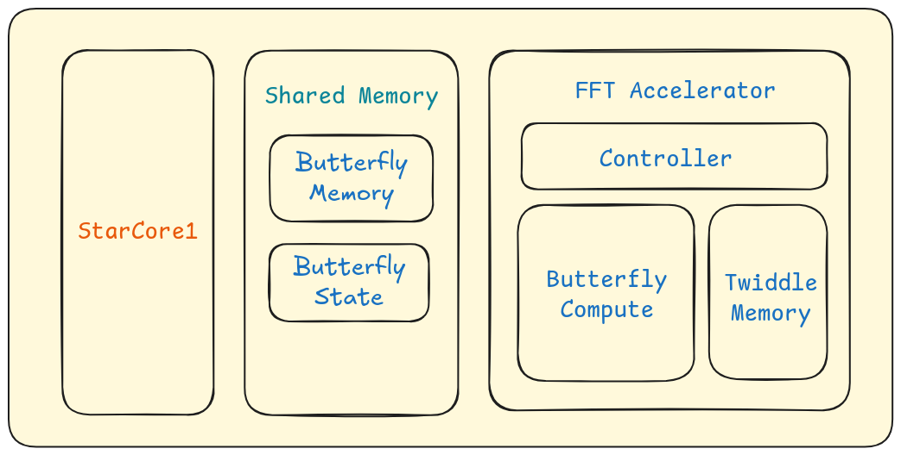
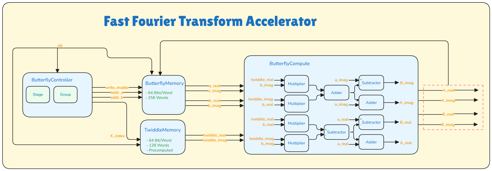
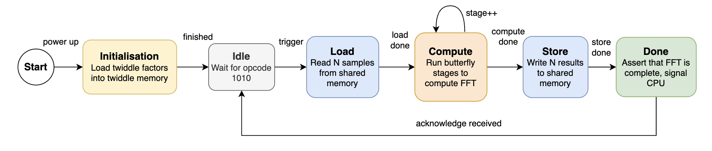

A dedicated FPGA hardware unit that performs Butterfly operations for FFTs. It communicates with the [StarCore-1](https://github.com/UCT-EE-OCW/EEE4120F/tree/master/Practical-4) (a Single-Cycle Processor in Verilog) via a shared memory-mapped area to process frequency-domain telemetry.

# Theory
## Fourier Transform

A Discrete Fourier Transform is a mathematical tool that converts signals from the time domain (how the signal changes over time) into the frequency domain (what frequencies it contains).

The standard formula for a DFT of sequence $x[n]$, with a total of $N$ samples, is:  
$X[k]=\sum_{n=0}^{N-1}x[n]\cdot e^{-j\frac{2\pi}{N}nk}$

## Algorithm
A Fast Fourier Transform (FFT) is an efficient way to compute the DFT. There are many FFT algorithms that are optimized for particular input and processing characteristics.

The Cooley-Tukey algorithm is a widely used algorithm. Normally, to find N frequency points from N time samples, $N\times N$ multiplications are required; each sample needs to multiplied by the probe frequency and added up. Instead, Cooley-Tukey uses a recursive strategy:
1. Divide: A large DFT is divided into smaller DFTs
2. Conquer: The small DFT is solved
3. Combine: A shortcut (Butterfly operation) is used to stitch the results

There are two ways to divide the data:
- Decimation-In-Time: split time-domain input sequence 
- Decimation-In-Frequency: split frequency-domain output sequence

## Notation
The defining characteristics of a Cooley-Tukey DFT are the number of input samples and decomposition base.

An X-point radix-Y FFT has the following characteristics:
- X is the input samples processed, determining the frequency resolution
- Y is the number of pieces a larger DFT is broken into at each stage

A 256-point FFT with radix-2 will require $\log_2{256}=8$ stages.

### Bit Reversal
In time decimation, the data is repeatedly split into "evens" and "odds". 

Consider this 8-point input.
- [0, 1, 2, 3, 4, 5, 6, 7]
- [0, 2, 4, 6] [1, 3, 5, 7]
- [0, 4] [2, 6] [1, 3] [5, 7]

The final result, it so happens, is the same as reversing the binary representation of the index.

| Initial | Final | Initial Binary | Final Binary |
| ------- | ----- | -------------- | ------------ |
| 0       | 0     | 000            | 000          |
| 1       | 4     | 001            | 100          |
| 2       | 2     | 010            | 010          |
| 3       | 6     | 011            | 110          |
| 4       | 1     | 100            | 001          |
| 5       | 5     | 101            | 101          |
| 6       | 3     | 110            | 011          |
| 7       | 7     | 111            | 111          |

## Butterfly Operation

The butterfly operation consists of a few simple operations. The radix-2 butterfly takes two complex numbers as input and produces two complex numbers as output.

Let the two inputs be $A$ and $B$.
1. $B$ is multiplied by a complex number called the Twiddle Factor ($W$)
2. The first output $A'$ is calculated as $A+(B\cdot W)$
3. The second output $B'$ is calculated as $A-(B\cdot W)$

The Twiddle Factor accounts for the phase shift between different samples by performing a rotation in the complex plane.

This structure is efficient because one multiplication is used to get two difference frequency outputs. These are then layered in stages, thereby reducing the complexity from $O(N^2)$ to $O(N\log N)$.

# Implementation

The accelerator is divided into distinct modules. These modules - along with surrounding dependencies - are shown in the high level block diagram.  



The architecture diagram below focuses on how modules are connected and specifies the inputs/outputs of each of these units.



The behavioural diagram shows different states and actions that cause transitions between these states. 




# Testing

First, create the input signal by setting a list of frequencies at the top of  `Golden-Measures/signal-generator.py` and running the script. The signal will be stored as a text file (`input-sequence.mem`) which is referenced when running the simulations. Each pair of lines represents the real and complex part (the file should have 512 lines). Run either of the software implementations with `python fft-fixed.py` or `python fft-floating.py`. This should correctly identify the frequencies in the signal.

To run the simulation, navigate to the `Verilog-Files` directory and execute:
``` shell
make soc_run
```
This will print the magnitude at each of the frequency bins. Non-zero magnitudes should match the selected frequencies. This output can be compared to the golden measure for accuracy/precision.

To view the waveform, use [GTKWave](https://github.com/gtkwave/gtkwave) and open the file under the waves directory (`waves`): `gtkwave waves/soc_run.vcd`. This file is tracked by the version control and can be inspected even without running the simulation.

# Credits

This topic and the base code was provided by the Professor Simon Winberg and EEE4120F team at UCT.  
Google's Gemini was used to assist with research (particularly for the theory section).

